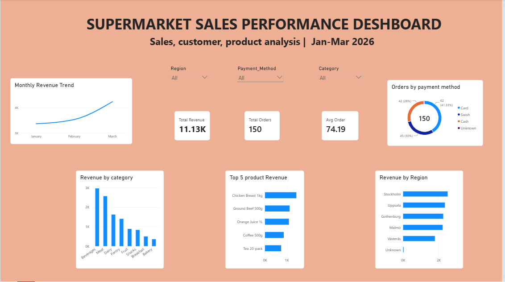

# Supermarket Sales Analysis

## 📌 Project Overview

This project analyzes supermarket sales data to understand sales performance, customer behavior, product performance, regional trends, and payment preferences.

The project follows an end-to-end data analysis workflow using **Excel, PostgreSQL, and Power BI**, from data cleaning and exploratory analysis to SQL querying and interactive dashboard development.

## 🎯 Business Questions

The analysis focuses on answering the following questions:

* What are the total revenue, total orders, and average order value?
* Which product categories generate the most revenue?
* Which products are the top performers?
* Which regions generate the highest revenue?
* How does revenue change month over month?
* Who are the highest-spending customers?
* How many customers make repeat purchases?
* Which payment methods are used most frequently?
* How do discounted and non-discounted orders compare?

## 🛠️ Tools Used

### Excel

* Data cleaning and validation
* Missing-value handling
* PivotTables
* Initial exploratory analysis
* Sales summaries and charts

### PostgreSQL

* Data filtering and aggregation
* `GROUP BY` and `HAVING`
* CTEs
* `CASE WHEN`
* Date analysis with `DATE_TRUNC()`
* Window functions
* `LAG()`
* `RANK()`
* `PARTITION BY`
* Month-over-month analysis

### Power BI

* DAX measures
* KPI cards
* Interactive charts
* Slicers and filters
* Dashboard development

## 📊 Key KPIs

| KPI                 |        Result |
| ------------------- | ------------: |
| Total Revenue       | 11,128.47 SEK |
| Total Orders        |           150 |
| Average Order Value |     74.19 SEK |
| Unique Customers    |            57 |
| Repeat Customers    |            44 |

## 🔍 Key Insights

* **Beverages** was the highest-revenue category, generating **2,965.15 SEK** and contributing approximately **26.64%** of total revenue.
* **Stockholm** was the highest-revenue region, generating **2,501.05 SEK**, representing approximately **22.47%** of total revenue.
* Monthly revenue increased from **3,367.27 SEK in January** to **3,533.20 SEK in February** and **4,228.00 SEK in March**.
* Revenue grew approximately **4.93% from January to February** and **19.66% from February to March**.
* **Card** was the most frequently used payment method with **62 orders**, representing approximately **41.33%** of all orders.
* **44 out of 57 customers** made more than one purchase, giving a repeat-customer rate of approximately **77.19%**.
* Discounted transactions had an average order value of approximately **77 SEK**, compared with approximately **70 SEK** for non-discounted transactions.

## 📈 Power BI Dashboard

The interactive Power BI dashboard includes:

* Total Revenue KPI
* Total Orders KPI
* Average Order Value KPI
* Monthly Revenue Trend
* Revenue by Category
* Top 5 Products by Revenue
* Revenue by Region
* Orders by Payment Method
* Region slicer
* Category slicer
* Payment Method slicer

### Dashboard Preview

## 📁 Repository Structure

supermarket-sales-analysis/
│
├── data/
│   └── supermarket_sales_beginner.xlsx
│
├── sql/
│   └── supermarket_analysis.sql
│
├── dashboard/
│   └── supermarket_dashboard.png
│
└── README.md

## 💡 Skills Demonstrated

* Data Cleaning
* Exploratory Data Analysis
* SQL Querying
* Aggregation and Filtering
* CTEs and Window Functions
* Customer Analysis
* Product and Category Analysis
* Time-Series Analysis
* DAX
* Data Visualization
* Dashboard Design
* Business Insight Generation

## 📌 Conclusion

The analysis shows positive sales momentum over the three-month period, with March generating the highest monthly revenue. Beverages and Stockholm were the strongest category and region respectively, while repeat purchasing represented a significant portion of customer activity.

This project demonstrates how Excel, PostgreSQL, and Power BI can be combined to transform raw transactional data into business insights and an interactive reporting solution.

